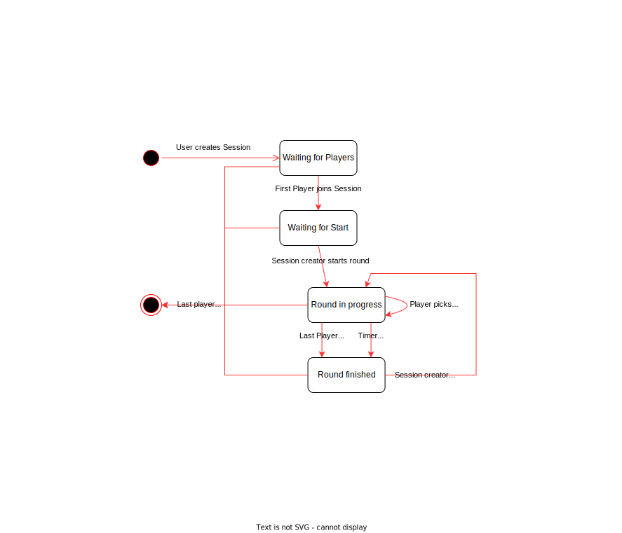

# planning-poker

A web app implementation of the [agile estimation technique "planning poker"](https://en.wikipedia.org/wiki/Planning_poker).
Playable [on my website](https://pp.felix-fluegel.de/).

- frontend: React
- backend: Nest.js
- backend <-> frontend: Socket.io

