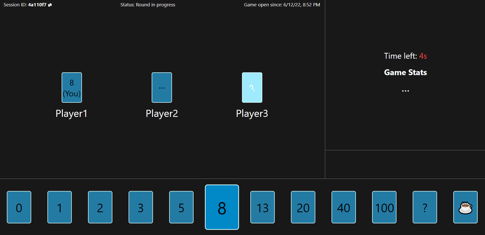

# planning-poker 
❗ WORK IN PROGRESS ❗

A web app implementation of the [agile estimation technique "planning poker"](https://en.wikipedia.org/wiki/Planning_poker).
- frontend: React
- backend: Nest.js
- backend <-> frontend: Socket.io
